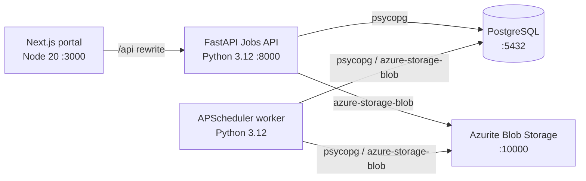

# Azure Debug Plan

> This plan is the source of truth for generating the
> VS Code debug setup in this workspace.
>
> **Status:** Implemented
> **Execution Mode:** Auto
> **Created:** 2026-09-29
> **Last Updated:** 2026-09-30
>
> <!-- Auto Mode skips the preview and approval gates. -->

## Prerequisites

| Tool / Extension | Category | Service(s) | Installed | Version |
|------------------|----------|------------|-----------|---------|
| Node.js | Runtime | web | ✅ | 26.10.0 (host); container uses Node 20 |
| npm | Package manager | web | ✅ | 11.19.1 |
| Python 3 | Runtime | jobs-api, discovery-worker | ✅ | 3.14.7 (host); containers use Python 3.12 |
| pip | Package manager | jobs-api, discovery-worker | ✅ | 26.2.1 |
| pytest | Test runner | jobs-api, discovery-worker | ✅ | 7.1.1 |
| Docker | Container runtime | jobs-api, discovery-worker | ✅ | 29.8.1 |
| Docker Compose | Compose provider | jobs-api, discovery-worker | ✅ | v5.5.1 |
| Google Chrome | Browser | web | ✅ | Installed app bundle |
| Docker extension (`ms-azuretools.vscode-docker`) | VS Code extension | web, jobs-api | ✅ | 2.0.0 |
| Python extension (`ms-python.python`) | VS Code extension | jobs-api, discovery-worker | ✅ | 2026.6.0 |
| TypeScript/JavaScript language support | VS Code built-in | web | ✅ | Built-in |

> ⚠️ **Action required:** The generated setup now uses an ignored project virtual environment, avoiding the host's PEP 668 restriction. Installation still fails on host Python 3.14.7 because pinned `psycopg==3.2.1` requires `psycopg-binary==3.2.1`, which has no matching Python 3.14 distribution. Use Python 3.12 for host debugging or update compatible dependency pins before relying on the API or worker debugger. The Docker image uses Python 3.12.

## Debug Configurations

Each checked row produces a VS Code debug configuration. Existing `.vscode/launch.json` and `.vscode/tasks.json` already contain these service and compound configurations. Reconcile the existing files in place without duplicating entries or discarding unrelated settings; keep the existing `compose.yaml` unchanged.

| Generate | Debug Config Name | Service Label | Service Root | Project Type | Runtime | Version | Azure Dependencies |
|----------|--------------------|---------------|--------------|--------------|---------|---------|---------------------|
| [x] | Job Recommendation Portal (debug) | Job Recommendation Portal | ./apps/web | frontend-spa | node-ts | 20 (Dockerfile) | — |
| [x] | Jobs API (debug) | Jobs API | ./services/jobs | app-service | python | 3.12 (Dockerfile) | PostgreSQL, Azure Storage |
| [x] | Discovery Worker (debug) | Discovery Worker | ./services/jobs | background-worker | python | 3.12 (Dockerfile) | PostgreSQL, Azure Storage |
| [x] | Debug All Services | Debug All Services | | *Compound Config* | | | |

Project Type Descriptions

| Project Type | Description |
|-------------|-------------|
| frontend-spa | Next.js frontend served by a development server and debugged in a browser |
| app-service | FastAPI HTTP server application |
| background-worker | Python scheduled worker process |

> ℹ️ **Proxy detected:** The Next.js frontend rewrites `/api/*` requests to the Jobs API. The compound configuration should start the API before the frontend; the worker can start alongside the backend.
>
> ℹ️ **Worker status:** `worker_main.py` starts an APScheduler process. Its scheduled callback is currently a no-op and does not yet access PostgreSQL or Blob Storage.

## Orchestrator

| Orchestrator | Container Runtime | Compose Command | Description |
|-------------|-------------------|-----------------|-------------|
| Docker Compose | Docker | `docker compose` | Preserve and use the existing `compose.yaml`; Docker Compose v5.5.1 is available. PostgreSQL and Azurite were stopped during final validation teardown without deleting named volumes. Podman is installed, but its engine readiness could not be confirmed, so use the confirmed Docker engine. |

## Emulators

| Dependent Service | Emulator | Purpose |
|-------------------|----------|---------|
| PostgreSQL | PostgreSQL Container | Local relational database for profiles, resumes metadata, recommendations, and discovery history |
| Azure Storage | Azurite Container | Local Blob Storage API for private resume PDFs |

## Architecture Diagram

The browser reaches the Next.js portal, which proxies API requests to FastAPI; the API uses PostgreSQL and Azurite, while the scheduled worker currently runs a placeholder callback.

## Migrations

The API applies the checked-in raw SQL migrations from `services/jobs/migrations` during FastAPI startup (`app.database.apply_migrations`). No separate migration task is selected because startup already applies the schema before serving requests.

| Generate | Service | Migration Tool |
|----------|---------|---------------|
| [ ] | Jobs API | Raw SQL (automatic API startup runner) |

## API Test Collections

| Generate | Service | Description |
|----------|---------|-------------|
| [x] | Jobs API | 

HTTP Endpoints (8)
 GET /api/health GET /api/v1/profile PUT /api/v1/profile POST /api/v1/resume GET /api/v1/recommendations PATCH /api/v1/recommendations/{recommendation_id}/decision POST /api/v1/recommendations/{recommendation_id}/application-link-opened GET /api/v1/history/runs 
 |

> ℹ️ **Route inventory:** These are the eight routes registered in `services/jobs/app/api/main.py`. The existing project plan says API Login is enabled, but no registration, login, or current-user routes are currently registered.

## Convenience Scripts

No additional package scripts are selected. The existing `compose.yaml` remains the local stack orchestrator.

| Generate | Script | Registered In | Description |
|----------|--------|---------------|-------------|

## Existing Setup State

- `.vscode/launch.json` and `.vscode/tasks.json` are present and include the web app, API, worker, and compound launch configuration.
- PostgreSQL, Azurite, and the Compose API container were running before validation. Final teardown stopped the containers without deleting named volumes; `Start Emulators` restarts PostgreSQL and Azurite.
- Host-side Python debugging remains unverified because Python 3.14 cannot install the pinned `psycopg-binary==3.2.1`; see the action required above.
- `worker_main.py` launches APScheduler; its scheduled callback is currently a no-op.

## Debug Configuration Checklist

Debug Configuration Checklist:
✅ Job Recommendation Portal (debug) — Next.js ready signal observed; the portal rendered at `/setup` and the dev server logged `GET / 200`.
❌ Jobs API (debug) — dependency setup failed on Python 3.14 because `psycopg-binary==3.2.1` is unavailable; the pre-existing Docker API health endpoint returned 200, but the host debugpy task did not reach readiness.
❌ Discovery Worker (debug) — shared dependency setup failed before the worker reached its scheduler-ready signal; HTTP verification skipped because the worker exposes no HTTP endpoint.
❌ Debug All Services — compound startup is blocked by the API dependency setup failure, so all members could not be confirmed started once, ready, and reachable.